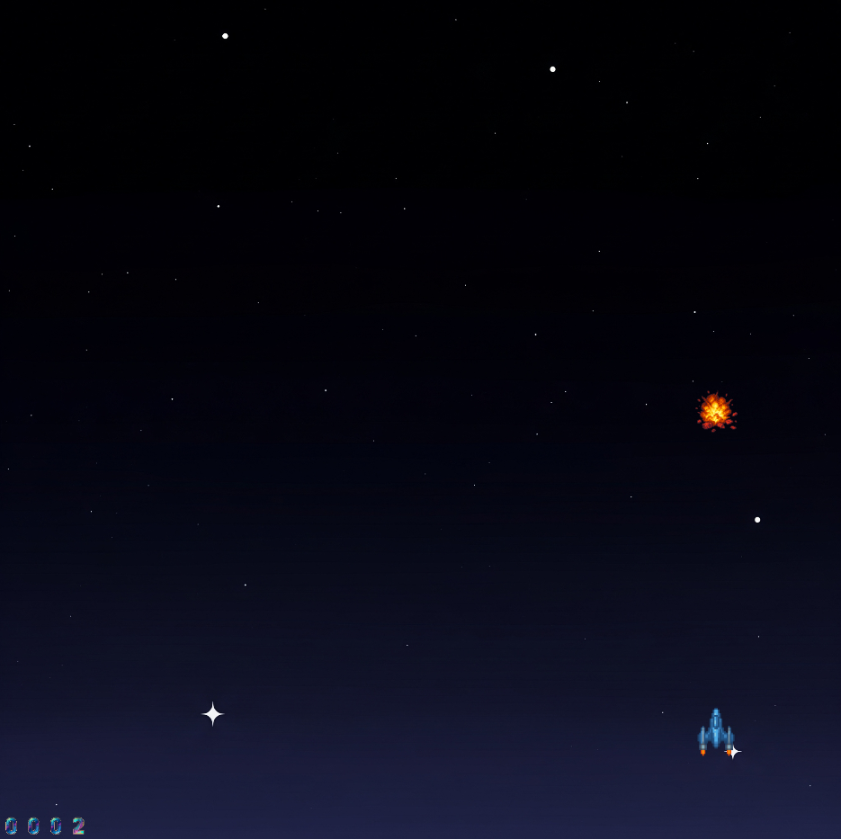

# Galactic Conflict

## Equipo de desarrollo

- Ferrario Mendoza Claudio
- Secco Miguel David
- Tundis Bruno
- Urdiales Nicolas
- Garcia Agustin
- Rodriguez Tobias Valentin

## Capturas

## Reglas de Juego / Instrucciones
### Objetivo
Controla la nave espacial y destruye a los enemigos que aparecen en pantalla para sobrevivir el mayor tiempo posible

Controles
- Teclas de dirección (↑, ↓, ←, →) para mover la nave en las 4 direcciones
- Barra espaciadora(space): Dispara proyectiles
- M : Volver al menu anterior
- P : Activar Musica
- R : Reiniciar
- Num 1 : Iniciar juego
- Num 2 : Instrucciones

## Otros

- Programacion Orientada a Objetos 1 /UNAHUR
- Versión de wollok 0.3.1
- Una vez terminado, queremos manternerlo privado

